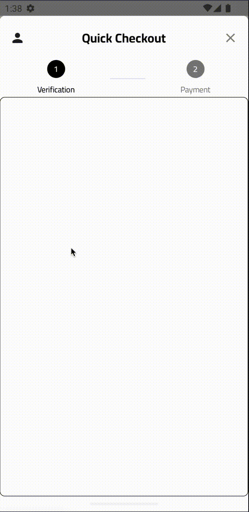
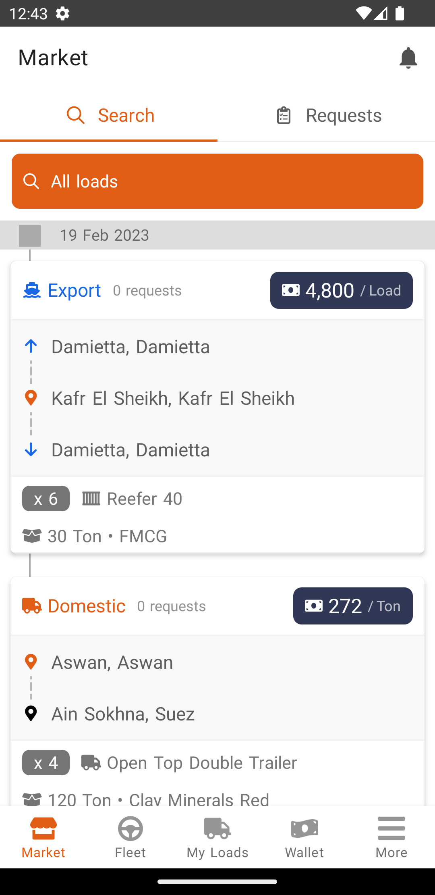
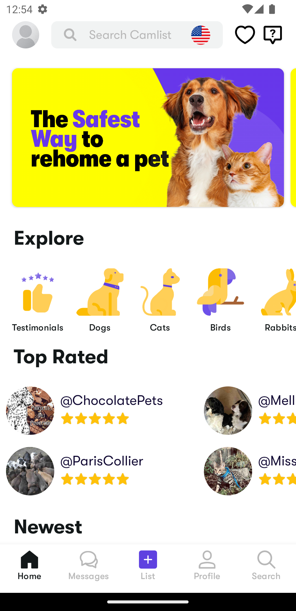

<h1 align="center">Hi, I'm a Senior Android Engineer 👋🏻</h1>
<h3 align="center">Passionate about creating mobile experiences</h3>

[//]: # (
  
)

- 💬 Ask me about **Kotlin, Kotlin Multiplatform, Android, Jetpack Compose**

- 📫 How to reach me **ahmed3elshaer@gmail.com**

- ⚡ Fun fact **When I was a kid, I had this crazy idea that if I swallowed a watermelon seed, it would sprout into a huge tree in my belly. 🍉🌳**

<h3 align="left">Connect with me:</h3>

  
  
   

💻 I love working on
------------

  
 
  
  
  
  

🧬 Projects
------------
| Project                                                                                                                                                                                                                                                                                                                                                                                                                                                                                                                                                                                                                                                                                                                                                                                                                                                                                                                                                                                                                        | Demo                                                                            |
|:-------------------------------------------------------------------------------------------------------------------------------------------------------------------------------------------------------------------------------------------------------------------------------------------------------------------------------------------------------------------------------------------------------------------------------------------------------------------------------------------------------------------------------------------------------------------------------------------------------------------------------------------------------------------------------------------------------------------------------------------------------------------------------------------------------------------------------------------------------------------------------------------------------------------------------------------------------------------------------------------------------------------------------|---------------------------------------------------------------------------------|
|  **Cryptographic passwordless authentication Payment SDK**   **Company** : [Amwal](https://www.amwal.tech/) Amwal is a payment technology based on Passkeys to use your biometrics to checkout in no time.   **Technology**  • [Jetpack Compose](https://developer.android.com/jetpack/compose) first app. • Implements the recommended Android [Architecture Guidelines](https://developer.android.com/topic/architecture)  • Integrates [Jetpack Libraries](https://developer.android.com/jetpack) holistically   • [Webauthn / Passkeys](https://fidoalliance.org/passkeys/) • Cryptography  • MVI & Clean Architecture • UI Testing  • Ktor   • Koin    **[> Browse](https://docs.amwal.tech/docs/using-the-payment-sheet-in-activity)**                                                                                                                                                                                       |  |
|  **Merchant Android and iOS Apps**   **Company** : [Taager](https://www.linkedin.com/company/taagercom/)  Taager allows you to sell and ship products that you don’t own and don’t stock, Gain without the risk of carrying inventory or making large investments. Start your online e-commerce business with zero investment today. Work from anywhere and make money online.   **Technology**   • Kotlin Multiplatform, Coroutines and Kotlin Native • Ktor • Jetpack Compose • MVVM & Clean Architecture • Reactive Programming  • Kodien   • SwiftUI      |              |
|  **Carrier, Parnter, Shipper and Ground Ops Android Apps**   **Company** : [Trella](https://www.trella.app/)  Trella is a platform that connects shippers to carriers. Trella offers services and technology to empower drivers, improve their efficiency, boost their earnings and utilization as well as creating job opportunities.   **Technology**   • Kotlin  • Java • Google Maps & Directions APIs • MVVM  • RxJava  • Dagger   • Retrofit                                                                                                                                                                                                                                                                                                                          |               |
|  **Pet Adoption Android App**    **Company** : [Camlist](https://www.camlist.com/)  Camlist are building a new standard in rehoming pets with safety and animal welfare as the primary focus.   **Technology**   • Kotlin and Kotlin Coroutines • Okhttp & Retrofit  • RxJava • MVVM  • Dagger   • ExoPlayer                                                                                                                                                                                                                                                                                                                                                                                                                                            |              |
|

⚒️ Technologies
------------
- Kotlin Multiplatform, Flow, Coroutines, Arrow, Native
- Jetpack Compose
- Android Jetpack
- MVVM, MVI and Clean Architecture
- Ktor
- Okhttp
- Hilt
- Dagger
- Koin
- RxJava
- SwiftUI

📝‍ Blogs
------------
- [How “Either” type will make you stop using “Result” class — Functional Programming in Kotlin](https://medium.com/p/d755ea7690db)
- [Don’t get stuck (An Advice in Learning Programming)](https://medium.com/@Ahmed3Elshaer/dont-get-stuck-an-advice-in-learning-programming-f0d0be61b95c)
- [Publishing Android library to Github packages with snapshot, dynamic versioning and product flavors](https://blog.trella.app/tech-edu/trella-technical-education-1-android-multi-module-multi-apps-structure/)

🧑🏻‍💻 Languages
------------

🕰️ Over the Last 7 Days
------------

